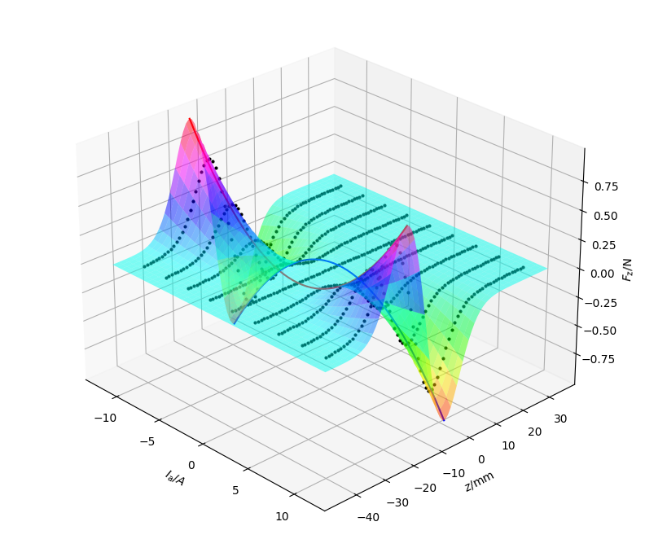

# gravitrax_coilgun
A Coilgun for GraviTrax Marble Run

Coilgun setup:

FEM Simulation (FEMM):

Fitting of FEM results (Matlab):

The fit is based on the following coenergy fit:

$$ E_{\mathrm{Co}} = \frac{1}{2} \cdot L_\mathrm{min} \cdot I^2 \cdot \left[ 1 + d \cdot \exp \left( - \frac{z - z_0}{z_\mathrm{s}} \right)^2 \right] $$

i.e.:

$$ F_{z} = \frac{\partial E_{\mathrm{Co}}}{\partial z} = - L_\mathrm{min} \cdot I^2 \cdot \left[ d \cdot \exp \left( - \frac{z - z_0}{z_\mathrm{s}} \right)^2 \right] \cdot \frac{z - z_0}{z^2_\mathrm{s}} $$

Dynamic System Simulation Model (Simulink):

