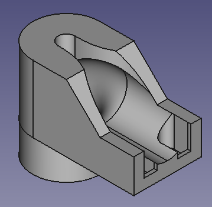

# Marble Accelerator
This project deals with the construction of various accelerators (coil guns) for metallic marbles. It might be used e.g. for the GraviTrax marble run. It has been used in various student projects in electrical engineering bachelor's and master's programs in the IEM department at the THM Friedberg, e.g. [this one](https://www.youtube.com/watch?v=bSArWLXCZdo) 

 

## Coilgun Designs

Coil winding cross sections are 15mm (coil length) x 7mm (inner radius 8mm, outer radius 15mm), leading to around 350 turns for 0.5mm wire diameter which results in an inductance of approximately 1mH.

### Horizontal coil design with two coils

Horizontal CAD design (base and tube parts)

 

The design is intended to be used with EVERLIGHT ITR9904 optical sensor for marble detection.

### Vertical coil design (single coil)

Vertical CAD design (base part and output)

  

The design is intended to be used with Vishay CNY70 optical sensor for marble detection.

The advantage of the vertical design is that the marble is at a defined state (no movement, $v_\mathrm{z} = 0$) at the beginning. This makes the accelerator parameters easier to tune, as the current level and duration of the current pulse are always the same.

## FEM Simulation (FEMM)

## Fitting of FEM results (Matlab)

The fit is based on the following coenergy equation:

- Co-Energy: $E_{\mathrm{Co}} = \frac{1}{2} \cdot L_\mathrm{min} \cdot I^2 \cdot \left[ 1 + d \cdot \exp \left( -0.5 \cdot \left(\frac{z - z_0}{z_\mathrm{s}}\right)^2 \right) \right]$

i.e.:

- z-Direction Force: $F_\mathrm{z} = \frac{\partial E_{\mathrm{Co}}}{\partial z} = - \frac{1}{2}  \cdot L_\mathrm{min} \cdot I^2 \cdot \left[ d \cdot \exp \left( -0.5 \cdot \left( \frac{z - z_0}{z_\mathrm{s}} \right)^2 \right) \right] \cdot \frac{z - z_0}{z^2_\mathrm{s}}$

- Flux Linkage: $\Psi = \frac{\partial E_{\mathrm{Co}}}{\partial I} = L_\mathrm{min} \cdot I \cdot \left[ 1 + d \cdot \exp \left( -0.5 \cdot \left( \frac{z - z_0}{z_\mathrm{s}} \right)^2 \right) \right]$

- Inductance: $L = \frac{\partial \Psi}{\partial I} = \frac{\partial^2 E_{\mathrm{Co}}}{\partial I^2} = L_\mathrm{min} \cdot \left[ 1 + d \cdot \exp \left( -0.5 \cdot \left( \frac{z - z_0}{z_\mathrm{s}} \right)^2 \right) \right]$

- Flux derivative: $\frac{\partial \Psi}{\partial z} = \frac{\partial^2 E_{\mathrm{Co}}}{\partial I \partial z} = - L_\mathrm{min} \cdot I \cdot \left[ d \cdot \exp \left( -0.5 \cdot \left( \frac{z - z_0}{z_\mathrm{s}} \right)^2 \right) \right] \cdot \frac{z - z_0}{z^2_\mathrm{s}}$ (needed for induced voltage calculation)

Resulting examplary fitted force:

## Dynamic System Simulation Model

The dynamic simulation implements the following equations:

- Velocity (z-direction): $\dot{v} = \frac{1}{m} \cdot F_\mathrm{z}$
- z-Position: $\dot{z} = v$
- Force calculation: $F_\mathrm{z} = F_\mathrm{z}\left(I, z\right)$ (see equation in chapter above)
- Coil current: $\dot{I} = \frac{1}{L \left(I, z\right) } \cdot \left[ u - R \cdot I - u_\mathrm{ind} \right]$
- Induced voltage: $u_\mathrm{ind} = \frac{\partial \Psi}{\partial z} \cdot v$

Model:

Coil electromagnetic subsystem:

## Power Electronics / Software

The software is designed for STM's B-G431B-ESC1 (Discovery kit with STM32G431CB MCU); it also includes the neccessary power MOSFETs. The supply voltage is 24V. An external capacitor of approximately 20mF is recommended in order to provide the high pulsed currents of 10..20A for durations of a few 10ms.

## Simlar projects

- [lincoln1clarke (Instructables) - Electromagnetic Marble Accelerator for Gravitrax](https://www.instructables.com/Electromagnetic-Marble-Accelerator-for-Gravitrax/)
- [HyperspacePirate (Thingiverse) - Electromagnetic Accelerator](https://www.thingiverse.com/thing:4918703)
- [William Le - Perpetual Marble Machine](https://lovelywings.store/)
